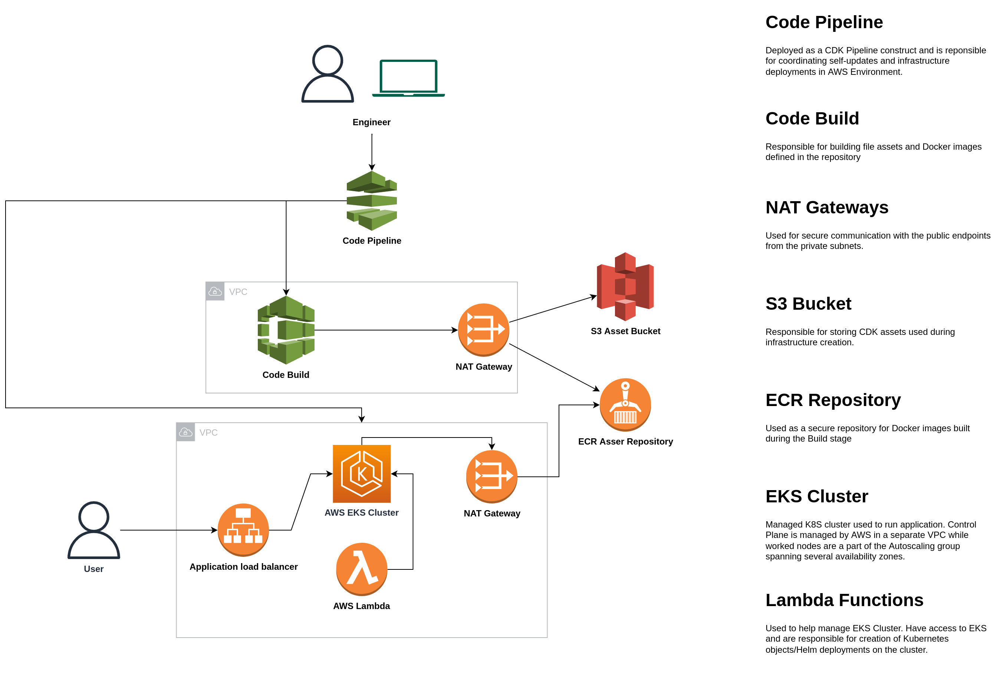
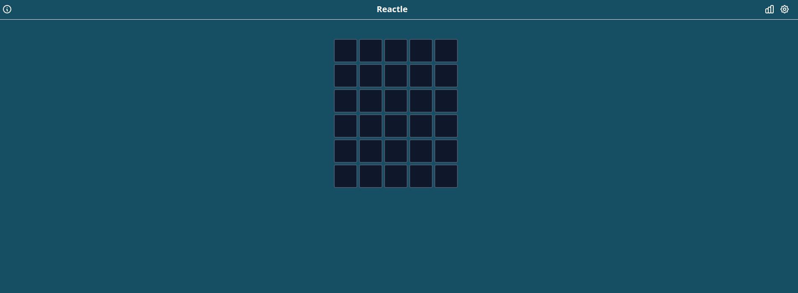
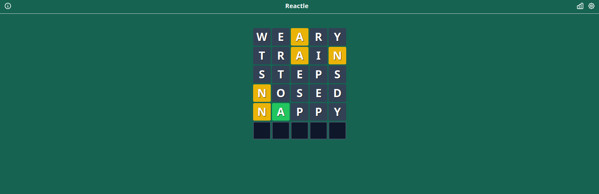

# Custom CDK deployment of Wordle



**NOTICE**
Application used as an example in this CDK project is a fork of: https://github.com/cwackerfuss/react-wordle

This is a project built to showcase capabilities of AWS CDK and CDK Pipelines in creating easily configurable and reliable application deployment pipelines.

This project is set up like a standard Python project.  The initialization
process also creates a virtualenv within this project, stored under the `.venv`
directory.  To create the virtualenv it assumes that there is a `python3`
(or `python` for Windows) executable in your path with access to the `venv`
package. If for any reason the automatic creation of the virtualenv fails,
you can create the virtualenv manually.

The `cdk.json` file tells the CDK Toolkit how to execute the app and contains variables using during the runtime,


After the init process completes and the virtualenv is created, you can use the following
step to activate your virtualenv.

```
$ source .venv/bin/activate
```

If you are a Windows platform, you would activate the virtualenv like this:

```
% .venv\Scripts\activate.bat
```

Once the virtualenv is activated, you can install the required dependencies.

```
$ pip install -r requirements.txt
```

At this point you can now synthesize the CloudFormation template for this code.

```
$ cdk synth
```

To add additional dependencies, for example other CDK libraries, just add
them to your `setup.py` file and rerun the `pip install -r requirements.txt`
command.

## Useful commands

 * `cdk ls`          list all stacks in the app
 * `cdk synth`       emits the synthesized CloudFormation template
 * `cdk deploy`      deploy this stack to your default AWS account/region
 * `cdk diff`        compare deployed stack with current state
 * `cdk docs`        open CDK documentation


## Deployment Steps

1. Fork the repository
2. Create [Personal access token](https://docs.github.com/en/authentication/keeping-your-account-and-data-secure/creating-a-personal-access-token) for your repository

3. Add a secret named `github-secret` to your AWS Account in the region you would like deployment to happen. Add your personal access token as a value.

4. Change variables `account_name`, `repository_name` and `branch_name` in **cdk.json** file to reflect your source repository. 

5. Run `cdk bootstrap` in order to prepare your environment for deployment. Environment is defined as AWS Account and region pair.

```
cdk bootstrap
```
6. Deploy the initial pipeline.

```
cdk deploy --all
```
From now on anytime you commit the changes to the pipeline, it will  update itself and then conduct a rolling update of the application.

## Output

The application will be available via an Application load balancer called `react` in the same AWS account.

An example deployment would look like this.



We can apply the changes to the underlying code to change a background color and push the changes to the repo. After the rolling update would happen and application would look like that.


